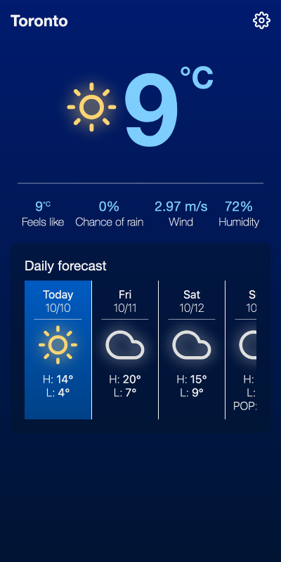

# Good Weather

A lightweight weather app which shows a 5-day forecast for a selected location.

Hosting URL: [https://good-weather-d60d7.web.app](https://good-weather-d60d7.web.app)

The app is designed to be used in the everyday, something you would open right before heading out the door, and one which would provide context on whether you should be prepared for adverse weather effects like heavy rain.

The focus is on relaying weather information quickly in laymen terms and arranged to promote important information first.

Dark mode:

Light mode:

Mobile view:

## Development

- `npm i` - to install dependencies
- `npm run dev` - open your browser to `localhost:9000`
- Create a `.env` file in the root directory and add env variables following the `.env.example` file

## Build
- `npm run build` - compiles the TypeScript code and bundles it to the {root}/dist folder

## Deploy
- Login and authenticate with firebase
- `npm run deploy` - deploys the project to Firebase
